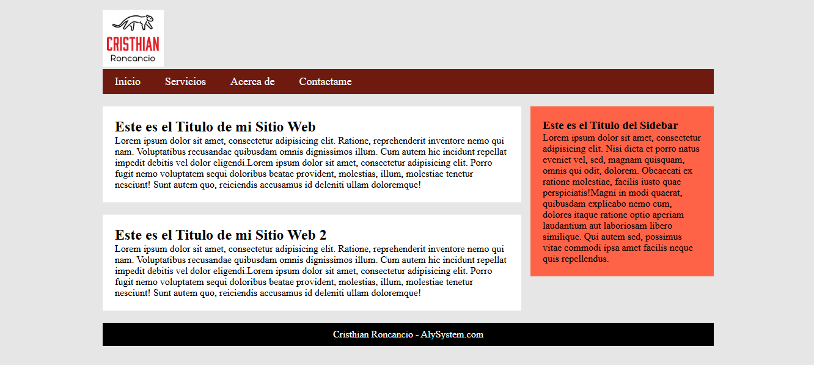

# 🌐 Basic Web Page Structure (HTML5 & CSS3)

This project demonstrates the **basic layout structure** of a web page using **HTML5** and **CSS3**.  
It includes the essential components of a traditional website: a navigation bar, main content area, sidebar, and footer.

---
## 🖼️ Project Preview

---

## 🧱 Features
- Clean and semantic **HTML5** structure
- Organized **CSS3** styling
- Simple **responsive layout** example
- Includes:
  - Navigation bar (`<nav>`)
  - Main content area (`<main>`)
  - Sidebar (`<aside>`)
  - Footer (`<footer>`)

---

## 📂 Project Structure

Basic-Web-Page-Structure/
│
├── styles/
│ └── index.css
│
├── img/
│ ├── thumbnail.png
│ └── Logo2.png
│
├── index.html
└── README.md

